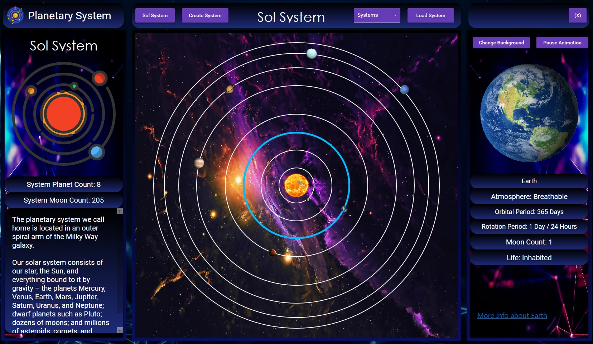
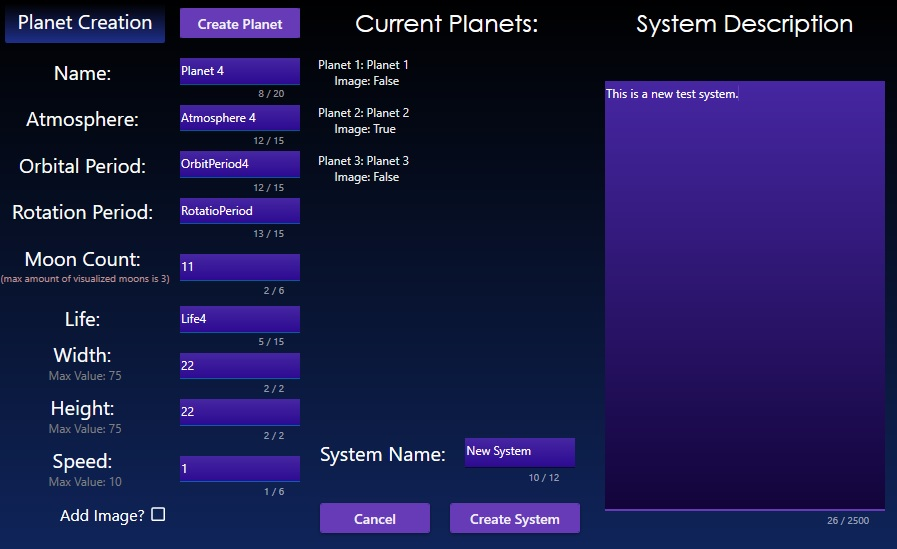
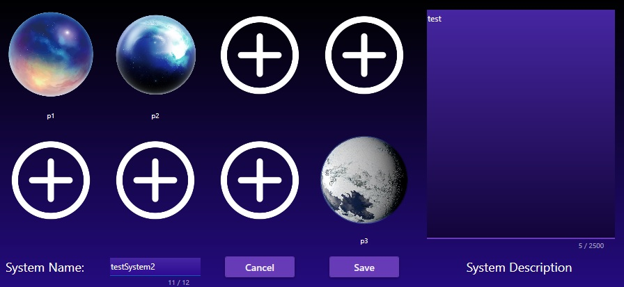
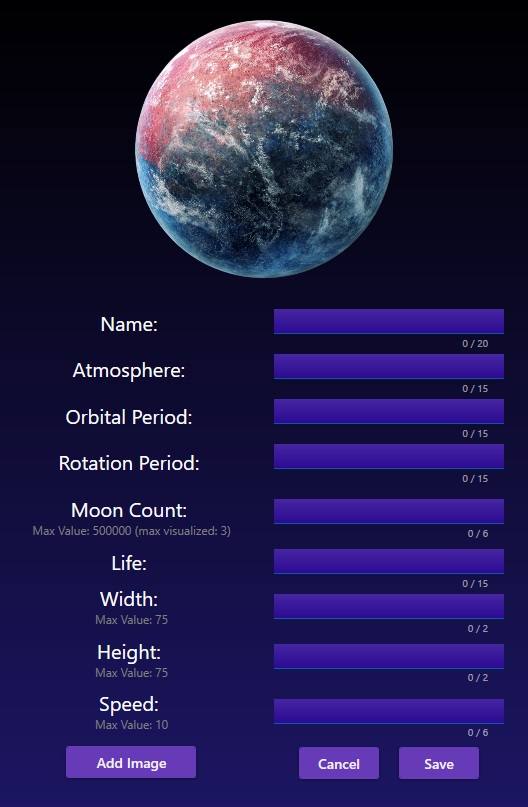
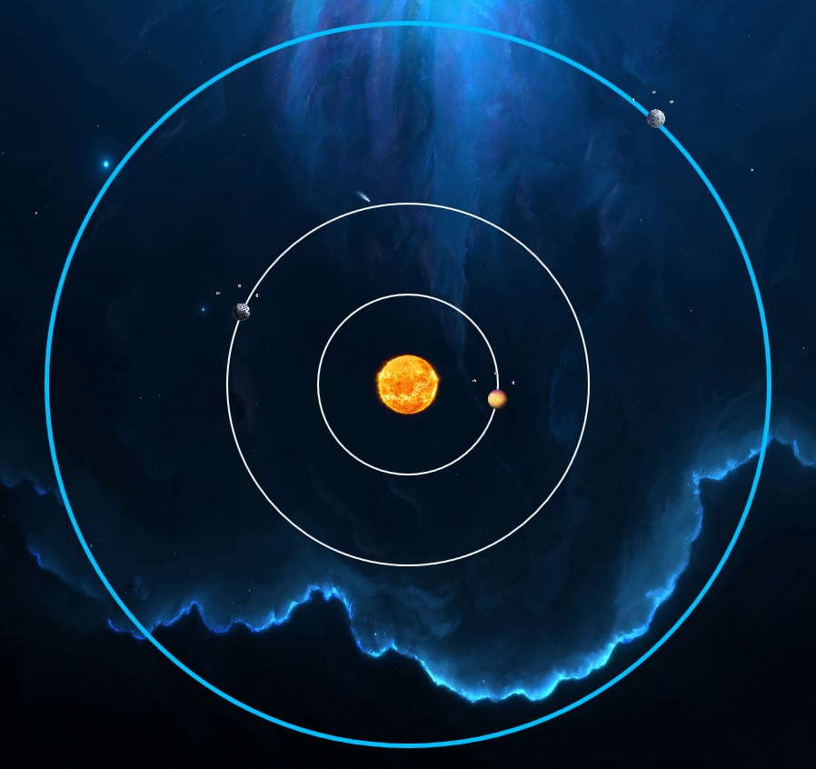
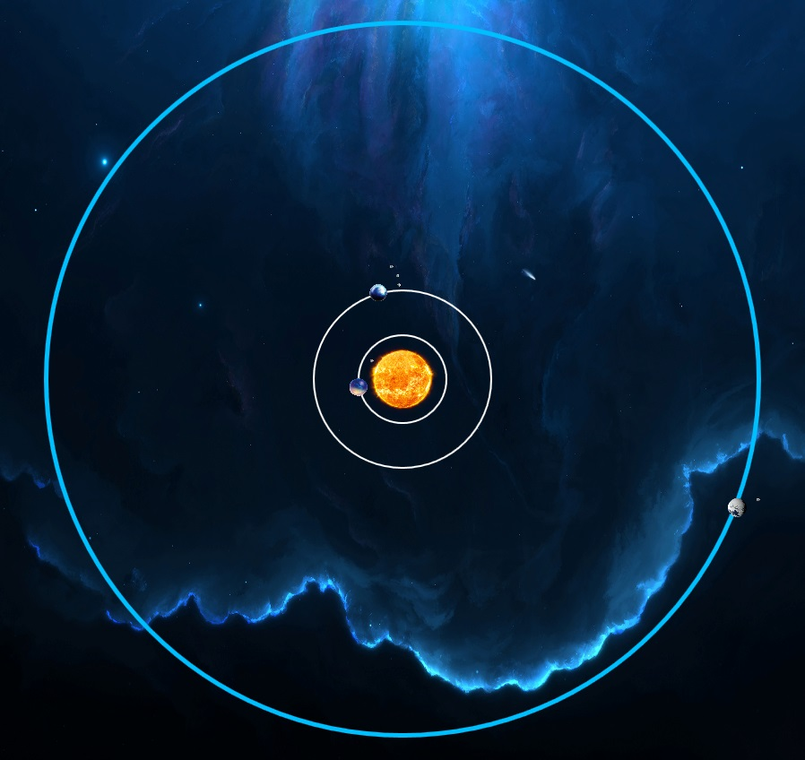
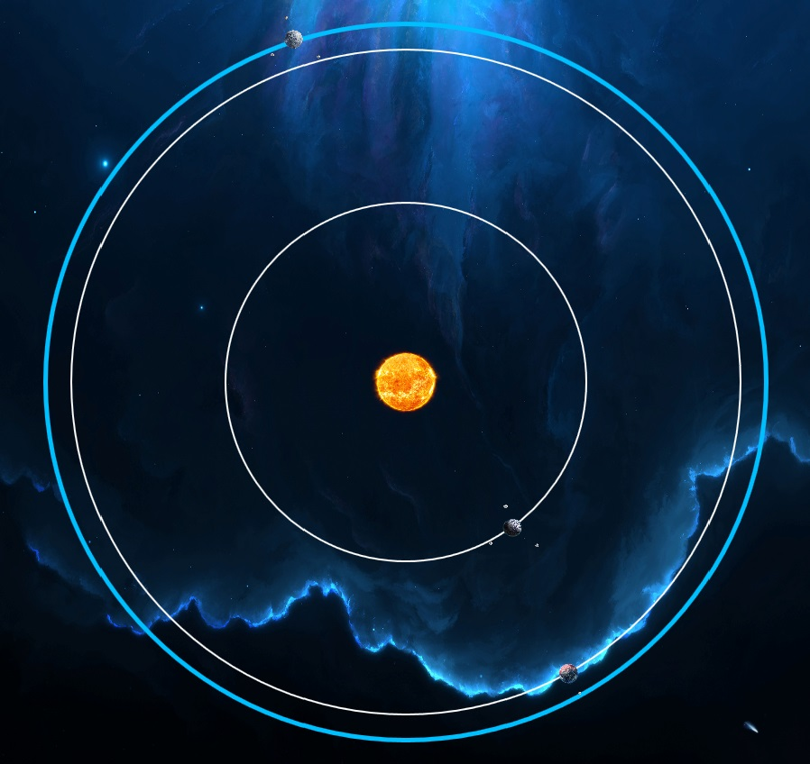
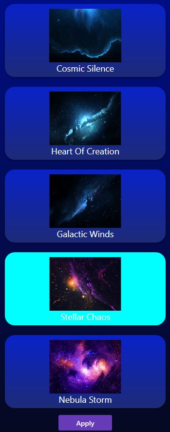

<h1 align="center">Planetary System 🌌</h1>

    An application that can create custom solar systems and display them on a 2D canvas with orbit animations.

  

## 🖥️ The Project
My first coursework project from Uni. The program is written in C# on the framework WPF. 
It can visualize 2D custom solar systems and planets, created by the user, with orbit animations. 

# Installation
* Download PlanetarySystem.v1.0.0.zip from the latest release and unarchive it
* Run setup.exe
* Choose installation folder
* Finish the installation
* Run the program with the exe in the install folder or with a shortcut 

(if installing in Program Files/Program Files (x86) run the program as administrator)

# Features:

## 🌌 Creating custom solar systems
The user can create custom solar systems with custom planets by entering the planets' data and choosing an image to visualize the planet. The maximum number of planets in a system is 8.

  Creating new system

  

The dimensions and the speed of a new planet are also determined by the user, and by entering a negative(-) value for the speed,
the direction of the orbit rotation changes. The maximum number of displayed moons for each planet is 3 but the user can enter a bigger moon count 
in the planet's data.

## 🌌 Editing custom solar systems
The user can add or remove planets at a chosen position in the system, change the system's name and description and delete the system altogether.

  Editing system

  

  Adding new planet

  

## 🌌 Different solar system layouts
The editing of systems allows for different layouts, depending on the positions of the planets.

  Layout Example 1

  

  Layout Example 2

  

  Layout Example 3

  

## 🌌 Animations!
The orbits are animated, with the option to change the speed, direction or pause the animation.

## 🌌 Canvas zooming
The user can zoom in and look at the systems they have created.

## 🌌 The model of our Sol System
The program has a built in model of our solar system with all the data written in. There's also a link to wikipedia for more information for each planet.

## 🌌 Changing the canvas background
Changing the space background to suit your space vibes!

  

# The UI
The front end of the application is written in XAML and most of the UI element styles are from the nuget package MaterialDesign.

# Serialization/Saving system data
All the custom systems and data, entered by the user, are serialized using the XML format and deserialized upon the start of the application.
